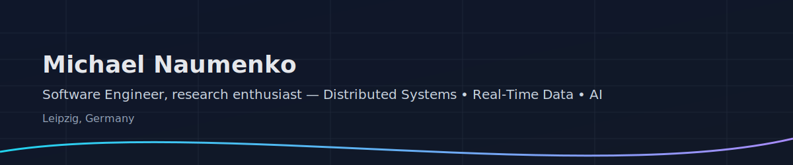

<p align="center">
  
</p>

<h1 align="center">Michael Naumenko</h1>
<p align="center">
  <strong>Software Engineer, research enthusiast</strong><br/>
  Leipzig, Germany
</p>

<p align="center">
  <a href="https://github.com/<GITHUB_USERNAME>">GitHub</a> •
  <a href="#">Website</a> •
  <a href="mailto:naumenko.research@gmail.com">Email</a> •
  <a href="https://linkedin.com/in/naumenko-fullstack">LinkedIn</a>
</p>

---

### About me

- Dream since 14: **study and collaborate with MIT**.  
- Early-stage **research enthusiast** exploring **Software Design in Distributed Systems** and **Real-Time Data** with practical use of **AI**.  
- Currently **working at BitCtrl Systems GmbH** and **studying Software Engineering & AI at American University Kyiv**.  
- I value clear invariants, observability, and reproducible engineering.

### Currently learning

- Deep-diving into **Distributed Systems** (consensus, replication, failure detectors, end-to-end backpressure).  
- Goal by New Year: publish a **big distilled summary** + a **capstone project** derived from my notes and lab work.

---

## Featured Projects (public / non-NDA)

> These are representative learning and portfolio repos. I’ll extend them as I go.

1) **mit-6.5840-notes-labs** — Notes, labs, and exam prep for **MIT 6.5840 Distributed Systems**.  
   _Focus:_ correctness, failure testing, and measurements.  
   **Stack:** Go (course labs), Markdown notes, test harnesses.  
   **Repo:** <https://github.com/<GITHUB_USERNAME>/mit-6.5840-notes-labs>

2) **streaming-iot-starter** — Boilerplate for **real data ingestion** (MQTT → Kafka) with basic metrics.  
   **Stack:** TypeScript, Docker, Kafka, MQTT, Prometheus, Grafana.  
   **Repo:** <https://github.com/<GITHUB_USERNAME>/streaming-iot-starter>

3) **ai-experiments-playground** — Small experiments applying **AI** to systems problems (summarizers, anomaly hints).  
   **Stack:** Python, TypeScript, notebooks, tiny services.  
   **Repo:** <https://github.com/<GITHUB_USERNAME>/ai-experiments-playground>

4) **realtime-3d-map-sandbox** — Minimal **Three.js** + **Next.js** sandbox for rendering live telemetry.  
   **Stack:** Next.js, Three.js, WebSockets.  
   **Repo:** <https://github.com/<GITHUB_USERNAME>/realtime-3d-map-sandbox>

---

## Skills & Tools

**Core:** C# · JavaScript/TypeScript · Python  
**Frontend:** React · Next.js · Three.js  
**Backend:** Nest.js · ASP.NET  
**Data/Streaming:** Kafka · MQTT · Docker containers · MongoDB · SQL · AWS S3 · DuckDB  
**Observability:** Grafana · Prometheus · cAdvisor · node-exporter · JMX

**Languages:** English · German (C1) · Ukrainian/Russian (bilingual) · French (A2)

<p>
  <!-- badges (dark theme friendly) -->
  
  
  
  
  
  
  
  
  
  
  
</p>

---

## Writing & Blog

I plan to cross-post technical notes from my portfolio site.  
- **Latest posts** (auto-updated via GitHub Action):  
  <!-- The list below will be updated by .github/workflows/update-blog.yml -->
  - (coming soon)

---

## Speaking / CFP

- **Dec 2025** — BitCtrl Systems training (internal).  
- **July 2026** — WeAreDevelopers presentation (topic: real-time data & distributed systems).

---

## Stats

<p>
  <!-- switch username + theme to your taste -->
  
  
</p>

---

## Collaboration

No problem — reach out via <a href="https://linkedin.com/in/naumenko-fullstack">LinkedIn</a> or  
<a href="mailto:naumenko.research@gmail.com">naumenko.research@gmail.com</a>.  
I’m especially interested in **Distributed Systems**, **Real-Time Data**, and **AI** work.

---

### Roadmap (high-level)

```mermaid
gantt
  title 2025–2026 Roadmap
  dateFormat  YYYY-MM-DD
  section Distributed Systems
  MIT 6.5840 labs & notes     :active, 2025-09-01, 2025-12-31
  Capstone project (derived)  :         2026-01-01, 2026-03-15
  section Writing
  Publish distilled summary   :         2025-12-01, 2026-01-20
  Blog series (3–5 posts)     :         2026-01-21, 2026-03-31
  section Speaking
  BitCtrl training            :         2025-12-01, 2025-12-31
  WeAreDevelopers prep        :         2026-04-01, 2026-07-01
